# Domestic-Fire-and-Smoke-Dataset
This dataset consists of domestic Fire and Smoke images. 

**Introduction**    
Dataset consists of Early fire and smoke images captured using mobile phones in real-world scenario. Images were captured under a wide variety of lighting conditions (indoor and outdoor scenes), weather, etc. This dataset is well suited for Early Fire and Smoke detection. Dataset could be used for Fire and Smoke recognition, detection, early fire and smoke, anomaly detection etc. Dataset also consists of typical domestic scenes like garbage burning, paper-plastic burning, field crop burning, domestic cooking etc.      

**Dataset Highlights:**
* Captured by 1000+ unique users  
* Domestic fire and smoke images    
* Early Fire and smoke Images  
* HD Resolution  
* Highly diverse  
* Various lighting conditions  
* Various weather condition  
* Indoor and Outdoor scene  
* Variety of view points  

**Dataset Format**  
* 2-class (fire and smoke) Bounding box annotation   
* COCO, PASCAL VOC and YOLO formats  
* Approx. 5000 unique images  

**Sample Images (Outdoor)**  
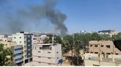 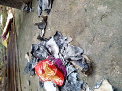 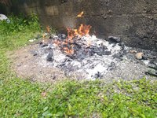 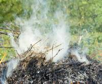 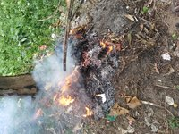 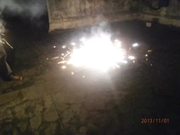 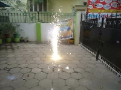

**Sample Images (Indoor)**  
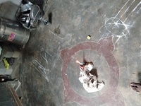 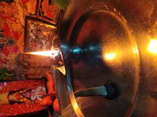 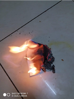 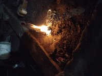 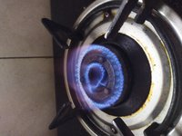 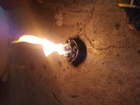 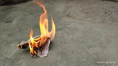  

# Datacluster Labs Datasets

Datacluster Labs focuses on Crowd Data Collection through our managed crowd-sourcing platform - [Dailydata](https://play.google.com/store/apps/details?id=com.daily.data). 

We provide integrated services for your AI needs:  
* Data Collection  
* Data Curation  
* Data Annotation 

We deal with all types of multimedia data collection and annotation like images, videos, audio, text and surveys.

**To download full datasets or to submit a request for your dataset needs, please contact **contact@datacluster.in****  

To download the full datasets, please contact [contact@datacluster.in](contact@datacluster.in).  
Visit [www.datacluster.in](www.datacluster.in) to know more.
    

**Note:**  
**All the images are manually verified and are contributed by the large contributor base on our platform.** 
